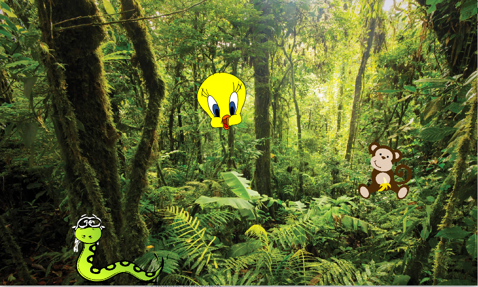

# Learning C++ Game Design

## Katie Foster, Shirin Kuppusamy, Mahima Beltur

### Our Goals

We did a series of C++ game design tutorials in order to meet our learning goals of becoming familiar with C++ and how to apply C++ to game design. After encountering difficulties with using Visual Studio to do the first tutorial that we selected, we altered our learning goal to encompass learning C++ in Linux, without the use of Visual Studio. Our MVP was to complete all the tutorials we identified as important, and our stretch goal was to collaboratively create a short game based on what we learned from the tutorials. We accomplished our stretch goal and were able to collaboratively develop a game that incorporated the elements we learned from the tutorials we completed.

### Learning
At first, we attempted to follow a tutorial that used Visual Studio. However, after the first week of the project, none of us were able to get the tutorial code working in Linux, and we soon realized that trying to solve this problem was not conducive to us achieving our learning goals. As a result, we decided to follow the tutorials produced by the game library used in the first tutorial, which is called SFML. Although tutorials focused more on learning to use the library, and less about how to design a game, we decided that they would be more useful to our learning. We would rather struggle with an error in our code than struggle with Visual Studio. We each followed several of the SFML tutorials, reading through the tutorials, copy-pasting code and compiling code, and modifying it to make sure we understood the code's function. The SFML tutorials ended up being a very useful learning exerience, and we were able to use the skills from the tutorials to make our own game.

https://www.sfml-dev.org/tutorials/2.5/

### Our Code
Our game/visualization consists of a window with a background image, an ambient background noise, and animal images. Upon left clicking the animal, the program produces a sound, and upon right clicking, the noise ends.

The first component of the project was getting a background image to appear on the window:

 ```
  sf:: Texture texture;
  texture.loadFromFile("runforrestrun.png");
  sf:: Sprite sprite_back;
  sprite_back.setTexture(texture);
 ```

The code above uses the sfml library to create an object of the Texture class that loads in the image from the given file. Then in order to place the image in a shape that can be displayed, we create a Sprite (a textured rectangle) set to the given Texture.

Next, we wrote code to allow the program to stream a constant background noise. To do this, we had to create a global variable
```sf::Music music;``` such that the object is not destroyed within the function and rendered unusable in main. To play the music, we used the following function:
```
void playBackground()
  {
      music.openFromFile("resources/forest_ambience.wav");
      music.play();
      music.setLoop(true);
  }
  ```
This function opens the music file, plays it, and sets the loop to true to allow it to continue to play for however long the window is open. When this function is called in main, it can continue to to play as the rest of the sequence executes because music plays on its own thread in sfml.

Creating the objects follows the same principle as creating the background image. An important part of this step was positioning the objects in places that are well spaced such that clicks don't overlap, but also such that they are aesthetically placed.

In order to recognize clicking on the image, we implemented a mouse click function, where we globally defined the event object:

```
if (event.type == sf::Event::MouseButtonPressed){
      if (event.mouseButton.button == sf::Mouse::Left){
        int x = event.mouseButton.x;
        int y = event.mouseButton.y;
 ```
If the event type is MouseButtonPressed and if it is a Left click, then we set the integers x and y to the position of the mouse. If the x and y positions are within the area encompassed by a shape, then the code recognizes the button press as a click on top of the shape and plays the sound. Here is an example:

 ```
   if((x-200)-150)<200 && abs((y-100)-450) < 100){
          std::cout << "Snake was pressed" << std::endl;
          playSound("resources/snakeHiss.wav");
 ```
 The playSound function called above is shown below:

 ```
  sf::SoundBuffer buffer;
  sf::Sound sound;
  sound.setBuffer(buffer);
  sound.play();
  sound.setLoop(true);
 ```
 This first segment of the function creates the SoundBuffer object and the Sound object. We use a Sound object instead of a Music object because the sounds are short enough that the audio data can be loaded in contrast to the ambient noise which could more effectively be streamed. It then plays the sound and sets the loop to true to continue playing the sound until it is stopped. Unfortunately, this code alone will not actually render a sound output because the sound is being repeatedly played with no pause to allow for processing. Thus, while the sound is playing, we add a sleep statement:

 ```
   while (sound.getStatus() == sf::Sound::Playing)
  {
    sf::sleep(sf::milliseconds(100));
  }
  ```
The last component of this function is to stop the sound and break out of the function ```sound.stop();``` if the mouse is right clicked. This follows a similar structure as the left click code detailed above.

### Reflection
One design decision we made was to encapsulate large chunks of code into functions and then call them in main. This posed a challenge because like other variables, SFML objects are not usable outside of the scope in which they were defined. Yet, in order for the functions to work as intended, operations need to be performed on the music, event, and window objects outside of the functions in which they are primarily used (the same instance of some of them are also used in multiple functions). Thus, we made the design decision to declare some variables globally, especially since we are working only in one .cpp file, and encapsulate code in fuctions. This was primarily advantageous because it helped make the flow of the code clearer, and it avoided repetition of large segments of code.

In terms of process, we primarily relied on our group chat and trello to document and divide labor. We all did our segment of tutorials. During the project, Katie worked with locating graphics and button clicking, Shirin worked with audio outputting, and Mahima worked with aesthetics/visual design. We did a lot of pair programming using zoom screen sharing, so we did a lot of committing code from one laptop while all contributing once we merged code.

Overall, we learned a lot from this project. We learned basic C++ syntax and declaration options. We also learned how to use the SFML library, and in doing so, got practice in learning from documentation. Furthermore, we achieved our learning goals of working with game design and using the tutorials we referred to in order to create an end product. Overall, we all learned a lot about how to work with the sfml library and C++ and feel more comfortable now being able to use this knowledge to create more complex projects in future. We were able to accomplish more than we'd hoped for, and overall feel satisfied. One thing we began experimenting with and want to look at more in future is using classes. Our above decision choice could have been simplified further by using self-defined classes and a more object oriented approach, so that is something we want to study more moving forward.

To play our game, run the following commands:
```
g++ -c game.cpp
g++ game.o -o sfml-app -lsfml-audio -lsfml-graphics -lsfml-window -lsfml-system
./sfml-app
```
You should also make sure you have the SFML libraries downloaded to your computer. You can follow the instructions in the tutorial we used to do so if you need guidance. 

Here's a screenshot of game display!


Enjoy!
